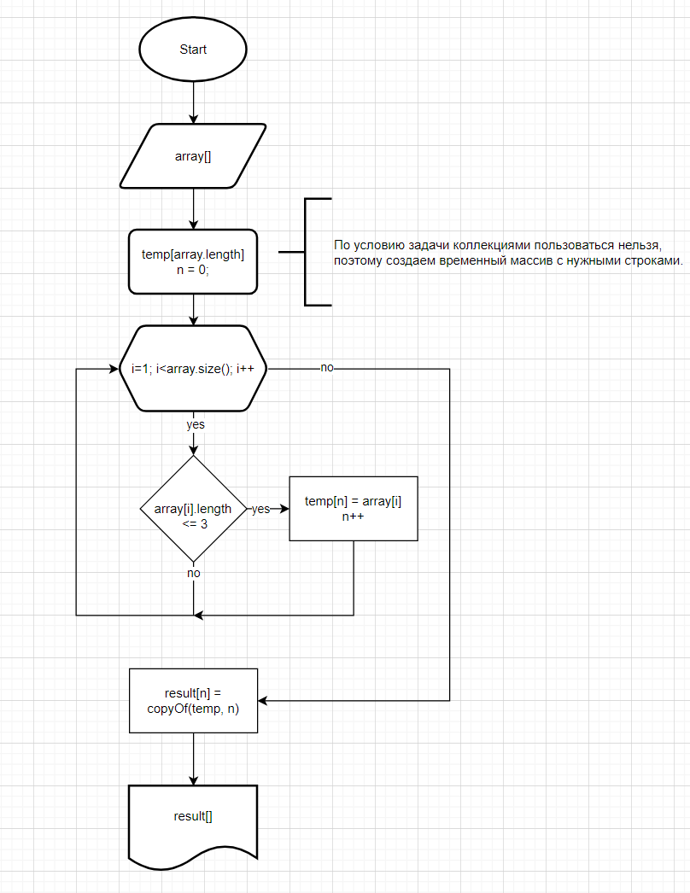

# Итоговая контрольная работа по основному блоку
## _"Знакомство с языками программирования"_

### Задача :
Написать программу, которая из имеющегося массива строк формирует новый массив из строк, длина которых меньше, либо равна 3 символам. Первоначальный массив можно ввести с клавиатуры, либо задать на старте выполнения алгоритма. При решении не рекомендуется пользоваться коллекциями, лучше обойтись исключительно массивами.

#### Решение на C#
_файл final.cs_

#### Блок-схема

